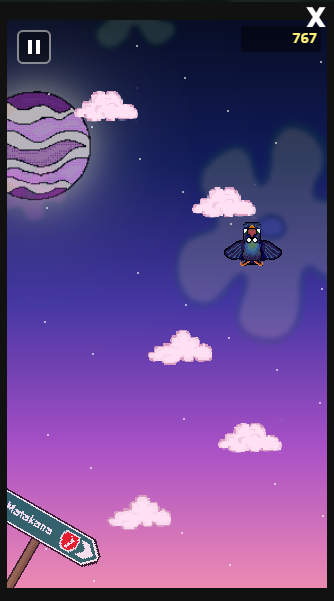
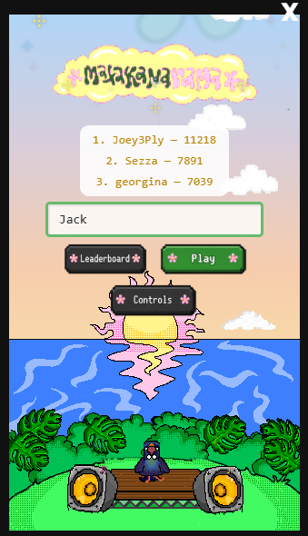
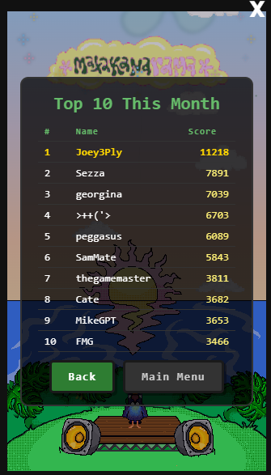

# Matakanarama Jump

A little cloud-jumping game built for the [Matakanarama](https://matakanarama.co.nz/) festival - and a bit of an excuse to over-engineer something fun.

You play as a Tui, the native NZ bird with the white bow tie and a lot of opinions, climbing as high as you can in a Doodle-Jump-style vertical run. Bounce off clouds and speaker tiles, dodge the monsters, grab the helicopter hat when it shows up, and see how far you get before gravity wins. Then submit your score and have a crack at the monthly leaderboard.

<table>
  <tr>
    <td align="center"></td>
    <td align="center"></td>
    <td align="center"></td>
  </tr>
  <tr>
    <td align="center"><b>Gameplay</b> Climbing through the night sky</td>
    <td align="center"><b>Main title screen</b> Top 3 at a glance, then straight into a run</td>
    <td align="center"><b>Leaderboard</b> This month's top 10</td>
  </tr>
</table>

## At a glance

- **Canvas-rendered game** - a Doodle-Jump-style vertical climber drawn straight to an HTML canvas, no game engine
- **Hand-drawn pixel art** - every sprite, background detail and UI icon drawn from scratch
- **Replay-based anti-cheat engine** - the server re-plays every run itself and only trusts its own result
- **Shared deterministic engine** - the exact same simulation code runs in the browser and on the server
- **Adversarial test suite** - fuzzed, tampered, truncated, padded and replayed attacks, all expected to fail closed
- **Injection-proof by design** - every database query is parameterised, no string-built SQL anywhere
- **Monthly competitions** - leaderboard, automatic period archives and one-click resets
- **Admin dashboard** - analytics, full play history and a human review queue for flagged scores

## Built with

| Area | Tools |
| --- | --- |
| Game | TypeScript, HTML5 Canvas |
| Art | Hand-drawn pixel art (sprites, backgrounds, UI icons) |
| Game logic | Pure, seeded, deterministic simulation in `src/engine/`, shared by client and server |
| Backend | Cloudflare Workers |
| Database | Cloudflare D1 (SQLite), parameterised `prepare().bind()` queries only |
| Anti-cheat | Server-issued seeds, single-use session tokens, tick-by-tick input replay validation |
| Testing | Adversarial validator tests in `src/worker/validator.test.ts` |
| Admin | Leaderboard, analytics, play/score history, period archives, flagged-score review |

## Playing it

It'll be live on the [Matakanarama website](https://matakanarama.co.nz/) shortly. Keep an eye out!

## The art

Every sprite in the game is hand-drawn pixel art. The Tui, the clouds, the monsters, the roadside sign, the flowers in the background, even the little pixel icons in the UI - all drawn from scratch, no stock or licensed asset packs.

It took longer than I'd like to admit, but it means the whole thing looks and feels like it belongs to the festival rather than to a template.

## How it's built

The game runs on an HTML canvas in the browser. Behind it sits a Cloudflare Worker with a D1 database that handles sessions, score submission, validation and the admin side of things.

The key design choice: the game's simulation lives in `src/engine/` and is shared, line for line, between the browser and the Worker. That one decision is what makes the anti-cheat below possible.

## Anti-cheat: the server never trusts your score

Any browser game with a prize on the line is going to attract someone with dev tools open and a POST request ready to go. So rather than asking "does this score look reasonable?", the server just plays your game again and sees what it gets.

Here's how a run works:

1. **Starting a run** gets the client a session token bound to a random seed the server issues. The client never picks its own map.
2. **Every input** (left, right or none) is recorded tick by tick into a compact replay log as you play.
3. **On submission**, the client sends that replay log, not just a final number. The Worker re-runs the exact same deterministic simulation from scratch, using the session's seed, and feeds it your inputs.
4. **Whatever score the server's replay produces** is the score that goes on the leaderboard. The number the client claimed is only kept alongside a flagged row so a human can compare the two. It's never trusted directly.
5. **Anything that doesn't cleanly validate** gets flagged for review instead of being quietly scored. That covers a missing, empty or corrupt log, a log that doesn't end on the actual death tick (truncated or padded), a log longer than any plausible run, or a session token that's already been used.

Because the replay is a pure, seeded, deterministic simulation - no I/O, no wall clock - the same seed and the same log always reproduce byte-identical results. There's no fuzziness for an attacker to squeeze through, and no risk of a legit player getting a false positive from the re-run.

### Tested against the things people will actually try

`src/worker/validator.test.ts` throws the usual tricks at it:

- Fuzzing the replay with random byte garbage of varying lengths
- Tampering with an otherwise legitimate log
- Truncating or padding a log around the real death point
- Replaying a log against the wrong seed
- Reusing a session token

All of it is expected to fail closed - flagged, not scored - rather than throw an error or slip through.

### SQL injection

This one isn't handled with input sanitisation bolted on at the end. It's structurally ruled out. Every query in `src/worker/db.ts` goes through D1's parameterised `prepare().bind()` calls, so anything a player types (display name, email and so on) is always passed as a bound parameter and never stitched into SQL text.

## Admin page

The festival team gets a backend page to run the competition without needing me in the loop:

- **Top 10 Leaderboard** - the current month's standings
- **Analytics** - stat cards for total plays, completed plays, average time played, scores submitted, average and highest score, and flagged count, plus a plays-per-day chart for the last 14 days
- **All Plays / All Scores** - every session and every submitted score, for manual review
- **Period Archives** - past months' leaderboards, snapshotted when the leaderboard resets (and backfilled from existing score data for months before the reset feature existed)
- **Flagged Scores** - submissions the anti-cheat couldn't validate, waiting for a human to **Approve** (which credits the score the replay computed, not the one claimed) or **Reject**
- **Reset Leaderboard** - archives the current top 10 and kicks off a fresh competition period

There's no automatic "you won!" email yet. Finding a month's top scorer is just a matter of reading it off the leaderboard or the archives. If that ever becomes a pain it's an easy addition, but it isn't a gap in the design - it just wasn't needed yet.

## Thanks

Built as a favour for friends at Matakanarama. It was a lot of fun to make, and I hope it's even more fun to play.

Cheers,
Jack
